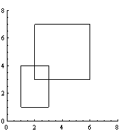

# D. Courts
## Info
| Points                   | 100     |
|--------------------------|---------|
| Memory Limit             | 32MiB   |
| Time Limit (case)        | 1s      |
| Time Limit (total)       | 1m0s    |
| Input/Output             | Console |
| Input size limit (bytes) | 10KiB   |
 

## Description
The school principal needs your help to redistribute the basketball and volleyball court in the schoolyard. Both courts will now be rectangles whose corners will be in integer coordinates within the new courtyard.

The director will give you the coordinates of the opposite corners of each new court and wants you to calculate the total area of the yard that will be covered by both courts.

Despite the size of the schoolyard, it may be that both courts can be overlapped, so you should take that into account so as not to count the area twice.

Write a program that given the coordinates of a pair of opposite corners of each court, calculate the total area covered by both courts.

 

## Input
Your program should read two lines from the keyboard, each one with 4 whole numbers separated by a space that represent the coordinates {x1}, {y1}, {x2}, {y2} of each of the courts.

 

## Output
Your program should write on the screen a single whole number that represents the total area covered by both courts

 

## Example

| Input                | Output | Description                 |
|----------------------|--------|-----------------------------|
| 1 1 3 4   2 3 6 7 | 21     |  |
 

## Limits
* 0 <= x1, y1, x2, y2 <= 10,000